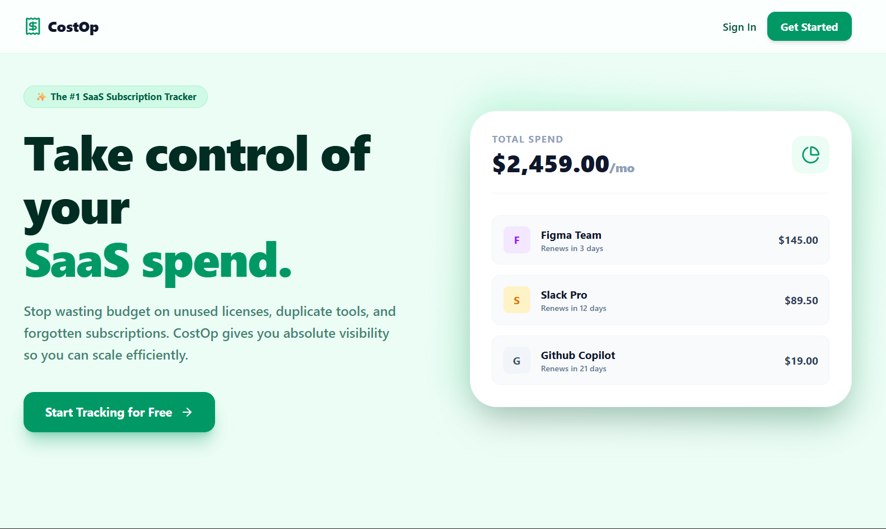

# CostOp
**Take control of your SaaS spend.**

## 🌟 About The Product

Organizations today waste thousands of dollars every year on ghost subscriptions, unused licenses, and duplicate tools. **CostOp** is a modern SaaS management dashboard built specifically to stop that bleed. 

CostOp is not just another tracking spreadsheet. It's an intelligent hub that gives you complete visibility over what you're paying for, alerts you before you get charged, and provides extreme clarity on where your budget is going month-over-month.

Whether you're an independent creator juggling personal tool stacks or a growing startup trying to optimize your runway, CostOp brings financial peace of mind directly to your screen.

### 🚀 Live Demo
The application is currently deployed and accessible at:
👉 **[costop1.vercel.app](https://costop1.vercel.app/)**

---

## ✨ How We Help You

- **Unified Visibility**: Track every software tool, license, and subscription across your entire organization from one incredibly beautiful dashboard.
- **Automated Renewals & Alerts**: Get proactive warnings days before your card gets charged. Say goodbye to surprise invoices and easily cancel unused tools on time.
- **Deep Spend Analytics**: Visualize exactly where your budget is going with clear financial metrics, custom categories, and month-over-month historical trajectory tracking.
- **Team Collaboration**: Securely invite team members and delegate workspace visibility so your entire organization stays on the same page regarding expenditures.

---

## 🛠️ Tech Stack

CostOp is built natively for scale and extreme performance:

**Frontend**
- **React 18** & **TypeScript**
- **Tailwind CSS** (for styling)
- **Framer Motion** (for liquid-smooth UI animations)
- **React Router** & **Vite**

**Backend**
- **Golang (Go)**
- **Gin Framework** (high-performance HTTP routing)
- **GORM** (for robust database associations)

**Database & Infrastructure**
- **PostgreSQL** (hosted via Neon DB)
- **Google OAuth 2.0** (authentication)
- **Resend** (email integrations)

---